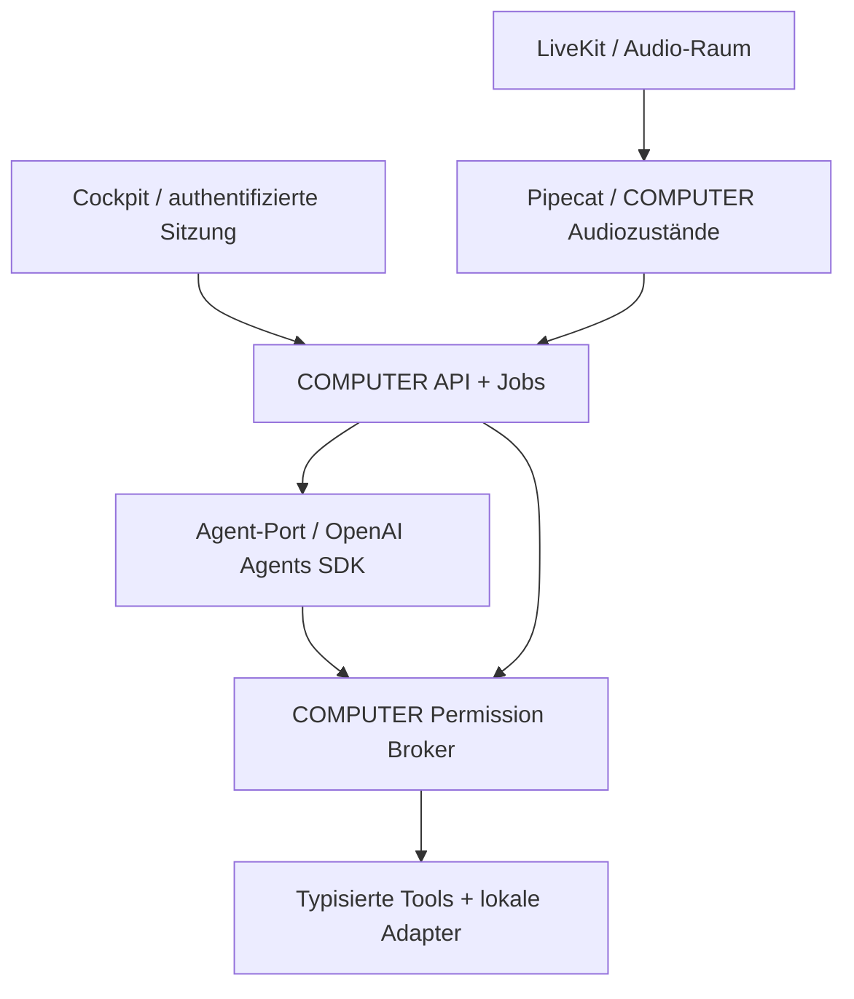

# COMPUTER — Auftrag 002 / Prototyp A

An Captain und Commander Sol. Stand: 20.09.2026.

**Prüfbare experimentelle Grundlage, kein Release und keine Zielhardware-Freigabe.**
Nur Prototyp A wurde gebaut. Prototyp B ist zurückgestellt; kein Sieger wird bestimmt.
`feature-v0.6.0` bleibt Referenz bei `7701906c30d28249e6c60a42203580494de0e22b`.
Alle neuen Laufzeitdateien liegen unter `prototypes/openai`; nur ein zusätzlicher
CI-Workflow liegt außerhalb. Kein vorhandenes Referenzmodul wird verändert/importiert.

## 1. Zusammenfassung und Evidenz

- **[CODE]** Eigener COMPUTER-Kern mit Broker, strikten Toolverträgen, Sitzungen,
  Jobsteuerung, authentifizierter lokaler API, Dokumenten und neuem Cockpit.
- **[TEST]** Echter OpenAI-SDK-Runner mit deterministischem Modell getestet.
  Toolfreigaben und Resume laufen durch COMPUTER. Ein zusätzlicher Test erteilt
  ausdrücklich eine native SDK-Freigabe und beweist: der COMPUTER-Broker blockiert
  weiterhin bis zur eigenen Entscheidung; SDK-Freigabe ist keine Sicherheitsinstanz.
- **[CODE]** Pipecat/LiveKit-Voicepfad mit Qwen-, STT- und Wake-Adaptern implementiert.
- **[TEST]** Audiozustände, Cancellation und Recovery mit synthetischen Adaptern;
  echte Pipecat-Frames durch Wake/Aufnahme/STT/SDK/TTS-Verkettung, Audio-Sink simuliert.
- **[OFFEN]** Reale Sprachqualität, Geschwindigkeit, Wake-/Barge-in-Zuverlässigkeit,
  LiveKit-Serverbetrieb, OAuth und Ziel-Windowsgerät sind nicht validiert.
- **[ENTSCHEIDUNG CAPTAIN]** Weibliche Qwen3-TTS-Stimme ersetzt Victoria als Ziel;
  kein männlicher Modus. Stil-Prompt in `computer/profiles/voice.json`.

Implementiert bedeutet Code vorhanden. Getestet bezeichnet nur den explizit benannten
Prüfstand. VALIDATED ist ausschließlich nach realem Zielworkflow zulässig.

## 2. Architektur

**Kern:** `contracts.py`, `broker.py`, `runtime.py`, `tools.py`, `documents.py`,
`memory.py`, `network.py`, `voice.py`. **Adapter:** `adapters/`.
Der Kern besitzt seine Freigaberegeln; Agent-HITL ist ein optionaler Komfortmechanismus.
Runtime hält aktuell den konkreten Agenten als injizierbare Factory; Prototyp B kann
hier denselben Vertrag und dieselben Tests einsetzen. Keine Framework-Typen in den
Broker-/Dokument-/Audioverträgen.

Das Cockpit verwendet lokale HTML/CSS/JS-Dateien, keine CDN-Skripte. Marken-/Theme-
Tokens liegen im CSS, Voice/Wake-Profil separat als JSON. Freigabe-Policy ist Python-
Servercode. Generierte Themes/Layouts sind nicht implementiert. Späterer generierter
JavaScript-Code darf nicht als vertrauenswürdiger Code auf dieser Origin laufen;
es braucht eine isolierte Darstellung und eng begrenzte Nachrichtenverträge.

**Lokales Gerät / Cloud:** Pipecat verbindet über LiveKit ausschließlich Audio;
Raumtoken sind keine Tool-Credentials. Registry kann Gerätezugriffe für einen
Cloudprozess sperren. Der enthaltene Server ist ein einzelner lokaler Prozess,
kein Cloudprodukt, kein Tenant-System, kein verteilter Durable-Workflow-Runner.

## 3. Wiederverwendung und neue Implementierung

Keine Jarvis-Laufzeitfunktionen kopiert. Übernommen wurden die dokumentierten
Produktanforderungen und die fixierte Identität/Prüfsumme des Computer-Wake-Modells.
Die alte Mikrofon-/Thread-Steuerung wurde nicht übernommen. Die Qwen-Stimme ist neu.
Neue Dokumentlogik bewahrt kanonischen Volltext und erzeugt ausschließlich neue IDs.

Master-Dokumentation v0.6.0 bleibt historische Übergabe. Dieser Bericht ist der
Prototyp-A-Nachtrag und dokumentiert insbesondere die geänderte Stimmentscheidung;
er schreibt die Historie nicht rückwirkend um.

## 4. Funktionsmatrix

| Fähigkeit | Implementierung | Tatsächlicher Nachweis / Grenze |
|---|---|---|
| Deutscher Agent | OpenAI Agents mit Responses; lokaler Chat-Completions-Adapter | SDK-Läufe mit Testmodell, echte Provider noch offen |
| Cockpit | Eigene dunkle Kommandozentrale, responsive, sichere DOM-Ausgabe | API-/JS-Prüfung; UI-Prüfstand separat protokolliert |
| READ / PREPARE | Striktes Schema, zentraler Dispatch | Echte SDK-Dokumentläufe ohne Freigabe getestet |
| EXECUTE / CRITICAL | Aktions-ID, Session, Argument-Digest, TTL, exakte Phrase | Freigabe, Ablehnung, parallel, Ablauf, Falschphrasen getestet |
| Pause / Resume | Kooperatives Gate, Fortsetzung im selben Prozess | Vor Toolausführung getestet; kein persistenter Neustart-Resume |
| Stop | Auftragsbezogenes Cancel, Pending löschen, Prozesse beenden | LLM/Tool/STT/TTS/Playback-Tests, kein Undo vergangener Effekte |
| Dokumente | TXT/DOCX/PDF, Liste/Download/Revision als Kopie | Reale lange Dokumente gelesen, Endmarker und Originale geprüft |
| News | Regionale feste RSS-Quellen, öffentliche HTTPS-Lesepolicy | Parsing implementiert; Quellenverfügbarkeit bleibt Netzwerkprüfung |
| Browser Bridge | Expliziter Klick, aktiver HTTPS-Tab, scoped Token, TTL | API-Rechte/URL-Tests; Chrome-Extension noch nicht real gekoppelt |
| Google Drive | Expliziter Read-only OAuth, OS-Keyring, Listenadapter | Keine echten Credentials; Auth/Refresh/Windows-Keyring offen |
| Settings | Session-Provider/Modell/Temperatur, feste sichere Endpunkte | Konfiguration und Key-Rotation mit Client-Mocks getestet |
| Memory | Explizite enum-basierte Sitzungsvorlieben | Keine freie sensible Memory; Ablehnung freier Felder getestet |
| Wake Word Computer | Gepinnter ONNX-Adapter, ein Eingangsstrom | Modellprovenienz aus Referenz, reale Erkennung offen |
| STT | Lokaler faster-whisper-Hilfsprozess, Deutsch/CPU/int8 | Prozessadapter implementiert; Modellinferenz offen |
| Weibliche Qwen-TTS | VoiceDesign-Prompt oder bestätigte Referenz mit Base-Modell | Kein Modell geladen; Stimmstabilität/Latenz offen |
| Audiozustände | Wake/Aufnahme/STT/Agent/TTS/Playback/Ruhe/Error | Synthetische vollständige Verkettung und Abbrüche getestet |
| Barge-in | Wake oder anhaltende Sprachenergie stoppt Turn/Playback | Experimentell; Echo-/VAD-Fehler auf Hardware prüfen |
| LiveKit | Pro Sitzung Raum, kurzlebige Mikrofon-Tokens, Pipecat-Transport | JWT-Rechte geprüft; WebRTC-Netzwerk nicht validiert |
| Geräte-/Power-Aktionen | Explizit simulierte Adapter hinter Broker | Keine echte OS-Wirkung, keine falschen Erfolgsresultate |
| run_python | Nicht registriert, fail closed | Verweigerung getestet; keine angebliche Sandbox |
| Anrufe / Telefonie | Nicht implementiert | Kein falscher Verbindungsstatus oder Anrufversprechen |
| Desktop-/Mobile-App / Cloud | Trennbare Verträge vorbereitet | Keine eigenständigen Clients oder Cloudplattform |

## 5. Sicherheitsdelta zu Auftrag 001

| Audit-Befunde | Behandlung im neuen Prototyp |
|---|---|
| B01, B28: Web-/Sessiongrenzen | Authentifizierung, feste Host/Origin-Prüfung, Body-Limit, kein ungeschützter WS-Steuerpfad |
| B02: file:/SSRF | Nur HTTPS/443, keine Redirects/Proxies, IP-Prüfung bei realem DNS-Auflösen |
| B03–B06: Freigabe/Abbruch | Exakte Phrase, immutable Argumentkopie, atomare Future-Entscheidung, Sitzung/ID/Digest, Cancel invalidiert Pending |
| B07–B10: versteckte Geräteeffekte | Keine generischen Desktop-/Python-Tools; Geräte ausschließlich simuliert und mindestens CRITICAL |
| B11–B12: falscher Erfolg | Strikte Resultatstatus; SDK-Max-Turn-/Fehlerpfad endet als Fehler |
| B13–B16: Audio-Konkurrenz/Recovery | Audio-Owner, bounded utterance, konsekutive statt kumulierte Stille, epoch-basierte Abbruchkontrolle |
| B17–B18: Settings/Keys | Modell/Temperatur explizit; keine Client-Wiederverwendung nach Key-Wechsel; Endpunkte operator-owned |
| B19–B20: Windows-Installer | Neuer PowerShell-Starter ohne venv-Löschung, Exitcodes geprüft; realer Windowslauf offen |
| B21–B23: Dokumentverlust | UUID + neue Revision + Volltext-Sidecar + Hash; kein 30k-Abschneiden, einmalige Textersetzung |
| B24: sensible Memory | Keine automatische Gesprächsextraktion, nur vorgegebene Präferenzwerte im RAM |
| B25: Prompt-Injection/Egress | Externe Inhalte als Tooldaten, Broker bleibt wirksam; semantische Injection/ungewollte Egress-Nutzung nicht vollständig gelöst |
| B26–B27: Settings/UI Injection | Strikte Requestmodelle, keine frei injizierbaren URLs/Keys/Policies, textContent statt HTML/onclick-Interpolation |
| B29: Integrationstatus | Nicht autorisiert/nicht verbunden/abgelaufen ausdrücklich sichtbar |
| B30–B32: Reproduzierbarkeit/Config | Direkte Kernversionen fixiert, lokale JS-Dateien; vollständiger Plattform-Lock und Config-Persistenz noch offen |
| B33: Windowsadapter | Keine ungeprüften realen Power-/Desktopaktionen; Hardwareprofil fehlt noch |
| B34–B35: Lizenzen/Produktstatus | Eigene Notice-/Statusdokumentation, klare COMPUTER-Identität; kein kommerzielles Freigabeversprechen |

Diese Tabelle behauptet keine vollständige Regression aller 35 alten Codepfade:
viele gefährliche Fähigkeiten werden im Prototyp bewusst noch nicht ausgeführt.
Sicheres Weglassen ist keine implementierte Funktionsparität dieser Geräteeffekte.

## 6. Tests und Grenzen

Lokaler Prüflauf: **46 Tests bestanden**, Python 3.12.14, Linux-Umgebung.
Ruff sowie JS-Syntaxchecks gehören zum Abschlussprüflauf. Eine Pipecat-Abhängigkeit
verwendet `audioop`; DeprecationWarning dokumentiert, Python deshalb aktuell <3.13.

Testdateien:
- `test_core.py`: Broker, Falschphrasen, Parallelität, Cancel, Pause/Resume, Dokumente,
  Schemas, Fehlerresultate, Session-/Cloudgrenzen und Memory.
- `test_api.py`: Auth, Host/Origin, asynchroner Stop, Settings, Bridge-Tokens, Inputlimits.
- `test_providers.py`: echte SDK-READ/PREPARE-Läufe; Client-/Providerparameter und Rotation mit Mocks;
  DNS-Prüfung und parallele Sessions.
- `test_sdk_hitl.py`: echtes SDK-Interrupt/RunState/Resume unter zusätzlicher COMPUTER-Autorität.
- `test_voice.py`: Cancel aller Audio-Phasen, Audio-Owner/Recovery/Ruhemodus, reale Pipecat-Frame-
  Verkettung mit simulierten Speech-Adaptern, signierte LiveKit-Tokenrechte.

Neue CI läuft getrennt auf Ubuntu und Windows, Python 3.12. CI ist keine Hardwarefreigabe.
Keine bezahlten LLM-Aufrufe, Modellgewichte oder echten persönlichen Daten für Tests.

## 7. Oberfläche / Produktbewertung

Designrichtung A: ruhige Kommandozentrale, marineblauer Hintergrund, mintfarbene
Akzente, eigener kreisförmiger COMPUTER-Indikator, klare Karten und reduzierte Navigation.
Keine Kopie von LCARS oder Jarvis. Zentral sind Sprachzustand, Auftrag und menschliche
Freigabe; Werkstatt, News, Verbindungen und Einstellungen sind eigene Ansichten.
Die mobile Darstellung ist eine responsive Webansicht, keine eigene Mobile-App.

Technische Details bleiben überwiegend in Einstellungen/Engineering-Status. Experiment-
und Hardwarestatus bleiben sichtbar, damit Simulationen nicht für Geräteleistung gehalten
werden. Die Oberfläche ist nicht Beleg für die Qualität des Agentenframeworks.

## 8. Komponentenbewertung — ohne Sieger

| Kriterium | OpenAI Agents SDK in A | Pipecat | LiveKit |
|---|---|---|---|
| Rolle | Agent-Loop/Tools/Modellanbindung | Audioframes/Pipeline | Audio-Transport/Räume |
| Eigene Grenzen | Broker und Sessionhoheit bleiben COMPUTER | Audiozustände und Owner bleiben COMPUTER | Token verleihen keine lokalen OS-Rechte |
| HITL/Resume | Native Interrupts getestet; App nutzt eigenen Broker und kooperativen Resume | Unterbrechungsframes | Transportpuffer müssen ebenfalls gestoppt werden |
| Typisierung | COMPUTER-Pydantic-Schemas als SDK-Tools | Typisierte Frames | Raum-/Teilnehmer-/Grant-Verträge |
| Providerfreiheit | Responses + lokaler Chat-Completions-Adapter | STT/TTS austauschbar | Transport unabhängig vom LLM |
| Testbarkeit | Echte Runner-Läufe ohne Netz möglich | Synthetische Frames gut prüfbar | Token offline prüfbar; Medien brauchen Server |
| Komplexität | Überschaubarer Adapter; SDK globales Tracing explizit ohne Exporter | Zusätzlicher Lifecycle/Frame-/Cancel-Aufwand | Zusätzlicher Server, Tokens, WebRTC/Netzwerk |
| Wartbarkeit | Paketversion gepinnt; Provider-Livetests fehlen | Version gepinnt, aktuelle PipelineWorker-API | Python/JS-Versionen separat gepflegt |
| Lizenzbasis | MIT laut Projekt | BSD-2-Clause laut Projekt | Server/SDK Apache-2.0 laut Projekten |
| Aktuelles Urteil | Tragfähiger Testkandidat; keine Entscheidung gegen Pydantic AI | Integration plausibel, Hardwarebeweis fehlt | Für mehrere Clienttypen passend; lokale Setupkosten real |

**Pydantic AI:** noch nicht implementiert oder unter denselben Tests gemessen. Architektur-
komplexität, Performance und Produktqualität dürfen daher nicht zahlenmäßig verglichen werden.
Qwen ist ebenfalls eine separat austauschbare Komponente; Modellauswahl und Performance
entscheiden wir nach Captains Hardwaredaten, nicht nach dem Agenten-SDK.

## 9. Offene Risiken / nicht fertig

1. Noch keine Ziel-Windows-, Mikrofon-, Qwen-/STT-/Wake- oder LiveKit-Medienvalidierung.
2. Hardwaredaten CPU/RAM/GPU/VRAM wurden beim Captain angefragt; keine gerätespezifische
   Optimierung ohne diese Daten. Bisher CPU-default als konservativer Ausgangspunkt.
3. Energie-basierte Aufnahme/Barge-in kann Echo/Umgebungsgeräusche falsch behandeln;
   robustes VAD/Echo/Audio-Stresstesten ist noch offen.
4. Qwen lädt pro Turn neu; erhebliche Latenz möglich. Keine Streaming-TTS-/Warmworker-
   Optimierung und kein klanglicher Reproduktionsnachweis der Hörprobe.
5. RunState/Approval/Historie nur im RAM, kein Crash-Recovery oder dauerhafter Resume.
6. Dokumente bleiben auf Platte, aber neue Session erhält keine automatische Zuordnung
   alter Entwürfe. Download empfohlen; Benutzerbibliothek/Retention/Recovery folgen.
7. Diskdaten/temporäre Dateien nicht zusätzlich verschlüsselt; OS-Account-Schutz vorausgesetzt.
8. Keine generische Python-Isolation, OS-Automation, Browserkäufe, Zahlungen oder rechtlichen
   Abschlüsse. Diese Fähigkeiten sind nicht durch einen pauschalen CRITICAL-Knopf freigeschaltet.
9. Semantische Prompt-Injection ist nicht gelöst. READ kann Daten an den explizit gewählten
   LLM-Provider weitergeben; keine allgemeine Datenklassifizierung/DLP vorhanden.
10. Keine vollständige transitive Windows/Linux-Lockdatei oder kommerzielle Lizenzfreigabe.
11. Browser-Origin-Sicherheit schützt nicht vor kompromittiertem vertrauenswürdigem lokalen
    UI-Code oder Malware im selben OS-Account. Zukünftige generierte UI muss isoliert bleiben.
12. Provider-Konfiguration und Vorlieben gelten pro Sitzung; kein System-Key-Editor in der UI.
13. Nicht unterstützte PDF-Glyphen führen zu einem Fehler statt stillen Ersatzzeichen.
14. Automatische WebSocket-Reconnect-/Voice-Raum-Wiederaufnahme und Token-Erneuerung sind
    noch keine robust getesteten Produktabläufe; Neuverbinden bleibt explizit.

## 10. Quellen und nächster Freigabeschritt

[EXT] Framework-Verhalten wurde anhand der installierten SDKs und Primärquellen geprüft:
- https://developers.openai.com/api/docs/guides/agents/running-agents
- https://developers.openai.com/api/docs/guides/agents/results
- https://docs.pipecat.ai/api-reference/server/services/transport/livekit
- https://docs.livekit.io/frontends/reference/tokens-grants/
- https://github.com/QwenLM/Qwen3-TTS

[CODE/TEST] Konkrete Implementierung und Tests in diesem Branch sind maßgeblich für die
oben genannten lokalen Befunde. Hersteller-Latenzangaben wurden nicht übernommen.

Nächster Freigabeschritt: Captain startet den Text-/Cockpitbetrieb und liefert Hardwaredaten.
Danach Voice-/Provider-/Gerätetest mit gemessenen Latenzen, Recovery und Stimmvergleich.
Kein Merge, keine Beta-Freigabe und kein endgültiger Framework-Sieger ohne Review.
